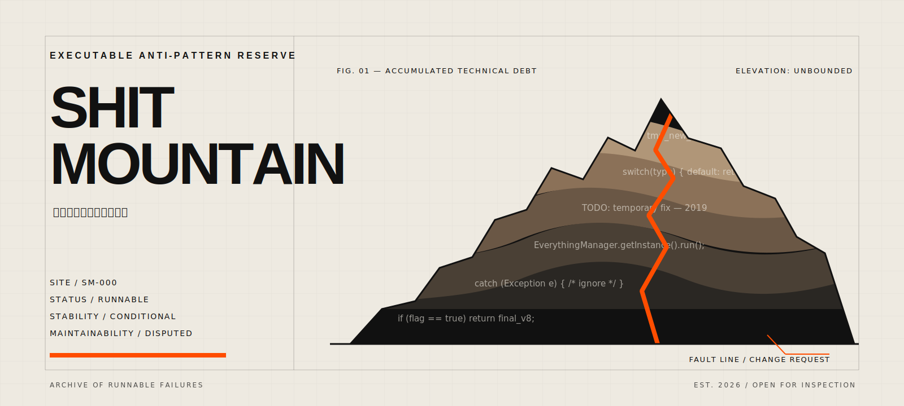

# Shit Mountain

<p align="center">
  
</p>

<p align="center">
  <strong>屎山代码保护区</strong><br />
  一座可运行、可讲解、可铲除的反模式博物馆。
</p>

<p align="center">
  <a href="#项目定位">项目定位</a> ·
  <a href="#景区导览">景区导览</a> ·
  <a href="#现有展品">现有展品</a> ·
  <a href="#屎山指数">屎山指数</a> ·
  <a href="#本地验山">本地验山</a> ·
  <a href="#贡献展品">贡献展品</a>
</p>

---

## 项目定位

这里不是烂代码垃圾桶。

这里收集的是那些**第一眼能跑、第二眼想跑、第三眼开始写事故复盘**的代码。每个展品都应该能够复现一种真实的软件工程反模式，并给出足够的上下文，让参观者看懂它为什么形成、会如何失控，以及怎样把它安全拆除。

> This is not a random code dump. It is a runnable museum of code smells, anti-patterns, and refactoring escapes.

### 四条山规

| 编号 | 山规 | 解释 |
|---|---|---|
| `SM-01` | 屎要臭得明白 | 必须解释问题所在，不能只靠低级命名制造视觉污染。 |
| `SM-02` | 屎要能够运行 | 默认分支上的展品必须可以编译运行，或明确标记为预期失败。 |
| `SM-03` | 屎要配铲子 | 应提供 `fixed/` 版本，或给出可执行的重构路线。 |
| `SM-04` | 搞怪不能投毒 | 禁止恶意软件、凭证窃取、破坏性脚本、真实密钥与针对真实系统的攻击代码。 |

本项目允许荒诞，不允许含糊；允许故意写坏，不允许不知道自己坏在哪里。

## 景区导览

```text
.
├── shit_demo.java                         # 镇山之屎：祖传五行代码
├── assets/
│   └── shit-mountain-hero-v2.svg          # 景区主视觉
├── exhibits/                              # 正式展区
│   └── java/
│       ├── 001-if-else-volcano/
│       │   ├── README.md                  # 条件分支火山档案
│       │   ├── bad/                       # 原始喷发现场
│       │   └── fixed/                     # 分支治理区
│       └── 002-one-class-to-rule-them-all/
│           ├── README.md                  # 王座厅与帝国解体报告
│           ├── bad/                       # 一个类统治整个公司
│           └── fixed/                     # 职责分权后的部门结构
├── scripts/
│   ├── smi.py                             # 屎山指数测绘仪
│   ├── tests/                             # 指数基准与回归测试
│   └── validate.sh                        # 山体稳定性检测
└── .github/                               # 景区管理处
```

目录结构刻意保持稳定。展品内部可以混乱，景区基础设施不能跟着一起塌方。

## 现有展品

| 编号 | 展品 | 主要罪名 | 山体状态 |
|---:|---|---|---|
| `000` | `hello-shitmountain` | 类名小写、孤立根目录、没有任何上下文 | 永久陈列 |
| `001` | `if-else-volcano` | 嵌套判断、魔法值、字符串类型系统 | 活跃喷发 |
| `002` | `one-class-to-rule-them-all` | God Object、共享状态、职责兼并 | 王座失控 |

### 001：If-Else Volcano

一个看似朴素的折扣计算器，逐渐吸收会员等级、节日活动、优惠券和临时需求，最终演化为条件分支火山。

展品同时提供：

- `bad/`：保留嵌套判断、魔法数字和“简单处理一下”的事故气质。
- `fixed/`：使用枚举、职责拆分与显式互斥规则恢复可维护性。
- 行为校验：坏版与修复版对同一输入保持一致输出，避免借重构偷改业务。

### 002：One Class to Rule Them All

一个“方便统一管理”的订单类逐步兼并用户、库存、定价、支付、通知、审计和老板临时需求，最终形成只有一个王座的职责帝国。

展品同时提供：

- `bad/`：`EverythingManagerFinalV2` 通过共享字段和超长方法控制所有部门。
- `fixed/`：`OrderService` 只负责编排，库存、定价、支付、通知和审计分别拥有清晰边界。
- 行为校验：帝国解体前后都输出同一订单结果，避免把“重构”变成业务改写。

## 屎山指数

Shit Mountain Index，简称 `SMI`，是一套确定性、可解释的代码异味启发式。它只扫描展品的事故现场，不调用外部服务，也不使用黑箱 AI 判断。

### 计分规则

| 信号 | 计分 | 单项上限 |
|---|---:|---:|
| 决策点：`if`、`for`、`while`、`case`、`catch`、逻辑操作符 | 每处 `+2` | `24` |
| 块嵌套深度 | 每层 `+4` | `16` |
| 魔法数字：排除 `-1`、`0`、`1` | 每处 `+2` | `20` |
| 含糊命名：单字母变量、非 PascalCase 公共类 | 每处 `+1` | `10` |
| 超长方法：超过 25 行 | 每 5 行 `+2` | `16` |
| 全局可变字段 | 每处 `+6` | `18` |
| 捕获 `Exception` / `Throwable` 与空 catch | 每处 `+8` / `+6` | `20` |
| “简单处理一下”“temporary fix”等可疑注释 | 每处 `+5` | `15` |
| 重复语句 | 每次重复 `+3` | `15` |

各项相加后总分封顶为 `100`。扫描器是轻量启发式，不冒充完整的 Java 语法分析器；它的价值在于结果稳定、规则透明、能够进入代码审查流程。

<!-- SMI:START -->
<!-- Generated by scripts/smi.py. Manual edits inside this block will be overwritten. -->

### 当前排行榜

| 排名 | 编号 | 展品 | SMI | 景区判定 | 主要贡献 |
|---:|---:|---|---:|---|---|
| 1 | `002` | `one-class-to-rule-them-all` | **100** | 建议原地成立事故调查组 | 决策点 24 / 魔法数字 20 / 全局可变状态 18 |
| 2 | `001` | `if-else-volcano` | **73** | 铲屎车进入一级战备 | 魔法数字 20 / 决策点 18 / 嵌套深度 12 |
| 3 | `000` | `hello-shitmountain` | **1** | 轻微异味，可步行参观 | 含糊命名 1 |

> SMI 仅用于教育、娱乐和代码审查训练，不用于评价开发者能力或工作绩效。
<!-- SMI:END -->

更新或检查排行榜：

```bash
python3 scripts/smi.py --write
python3 scripts/smi.py --check
```

## 本地验山

需要 JDK 17 或更高版本，以及 Python 3.10 或更高版本。

```bash
bash scripts/validate.sh
```

验山脚本会：

1. 运行 SMI 回归测试。
2. 确认 README 排行榜没有过期。
3. 发现并编译仓库内的 Java 展品。
4. 执行坏版与修复版。
5. 在评分漂移、排行榜过期或任一展品失效时以非零状态退出。

当前自动化原则很简单：**代码可以难看，但整座山必须还能启动。**

## 贡献展品

请先阅读 [`CONTRIBUTING.md`](CONTRIBUTING.md)。标准施工流程如下：

1. 在 `exhibits/<language>/<number>-<slug>/` 创建独立展品。
2. 编写展品 `README.md`，说明形成原因、爆炸方式和重构路线。
3. 将事故现场放进 `bad/`，将修复方案放进 `fixed/`。
4. 运行 `python3 scripts/smi.py --write` 更新排行榜。
5. 运行 `bash scripts/validate.sh`。
6. 提交 Pull Request，并使用 `[展品]`、`[铲屎]` 或 `[景区建设]` 前缀。

### 合格展品

- 荒谬，但来自真实的软件工程问题。
- 搞怪，但技术解释足够准确。
- 故意糟糕，但糟糕之处可以被验证和讨论。
- 提供修复方案，同时承认重构中的取舍。

### 拒绝入园

- 单纯无法编译且没有教学目的的代码。
- 只有冒犯性命名，没有可分析的工程问题。
- 包含真实个人信息、凭证、私有源码或恶意载荷的内容。
- 复制第三方事故现场，却没有授权或去标识处理的内容。

## 维护哲学

> 展品可以是屎山，仓库本身不能成为屎山。

因此，本仓库的目录、验证脚本、贡献流程和默认分支保持克制与可预测。搞怪属性存在于叙事、命名和展品设计中，而不是通过牺牲可诊断性和维护成本来实现。

## 免责声明

本项目用于教育、娱乐与代码审查训练。请勿把 `bad/` 中的代码复制到生产环境。如果你已经复制了，请至少不要把本仓库写进事故复盘的“参考资料”一栏。
